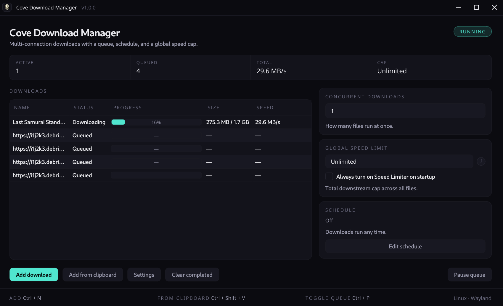

# Cove Download Manager

A multi-connection download manager with a real queue, a daily schedule
window, and a global speed cap. Built on `aria2` for the protocol work and
PySide6 for the UI. Same look as the rest of the Cove suite.




---

## Features

- **1-32 connections per file** - IDM-style dropdown (1, 2, 4, 8, 16, 24, 32),
  default 16. Per-file segmenting handled by aria2.
- **Concurrent queue** - 1-16 parallel downloads. Default 1; bump to 2-4
  for small files.
- **Start / Pause queue** - pausing only stops what's actively downloading;
  individually-paused items stay paused after a queue resume.
- **Global speed cap** - KB/s limiter with an "Always on at startup" toggle.
  Hot-applied via aria2's `changeGlobalOption`, no restart required.
- **Daily schedule window** - restrict downloads to a time window per
  weekday, midnight-wrap supported. Outside the window the queue parks
  itself; inside it picks up where it left off.
- **Add from clipboard** - paste many URLs at once, pick which to queue.
- **Delete key + right-click menu** - remove selected, clear completed,
  clear all. Multi-select aware. File deletion is opt-in per row.
- **Resumable** - queue state persists in SQLite, partial downloads resume
  via aria2's control files. Closing the app does not lose work.
- **Auto-update** - checks GitHub Releases on launch. Always prompts
  before installing, never silent, and refuses to install assets that
  don't match a published `SHA256SUMS` digest.
- **Browser extension** - intercept downloads from Firefox, Zen, LibreWolf,
  and other Firefox-based browsers. See [Browser Extension](#browser-extension).
- **Frameless cove UI** - custom titlebar, dark `#0b0b10` palette, mint
  accent. Dragging via `startSystemMove`, edge-resize via
  `startSystemResize`, both Wayland-safe.

---

## Install

### Linux - AppImage

Download the latest [`Cove-Download-Manager-<version>-x86_64.AppImage`](https://github.com/Sin213/cove-download-manager/releases/latest)
from the Releases page.

```bash
chmod +x Cove-Download-Manager-*.AppImage
./Cove-Download-Manager-*.AppImage
```

The AppImage requires `aria2` on `PATH` (`sudo pacman -S aria2`,
`sudo apt install aria2`, or your distro's equivalent).

### Linux - Debian / Ubuntu

```bash
sudo dpkg -i cove-download-manager_<version>_amd64.deb
sudo apt -f install   # if dependencies are missing
```

The `.deb` declares `Depends: aria2`, so apt pulls it in for you.

### Windows

Two builds on the [Releases](https://github.com/Sin213/cove-download-manager/releases/latest) page:

- **`Cove-Download-Manager-<version>-Setup.exe`** - Inno Setup installer,
  per-user (no admin prompt), Start Menu + optional desktop shortcut.
- **`Cove-Download-Manager-<version>-Portable.exe`** - single-file build.
  No install, nothing in the registry, runs from anywhere.

Both Windows builds bundle `aria2c.exe`, no system aria2 required.

> On first launch, Windows SmartScreen may show a warning because the
> `.exe` isn't code-signed. Click **More info** then **Run anyway**.

### Verifying downloads

Every release ships a `checksums-sha256.txt` file. Verify with:

```bash
sha256sum -c checksums-sha256.txt
```

(or `Get-FileHash -Algorithm SHA256` on Windows). Cove's auto-update
verifies this digest before swapping any binary.

---

## Browser Extension

Install the [Cove Download Manager extension](https://addons.mozilla.org/en-US/firefox/addon/cove-download-manager/)
from Firefox Add-ons. It works with Firefox, Zen, LibreWolf, Waterfox,
Floorp, and other Firefox-based browsers.

### How it works

1. Install the extension from the link above.
2. Launch Cove at least once so the native messaging host is registered.
3. Open the extension's settings page and click **Test Connection to Cove**
   to confirm the link is active.

Once connected, the extension intercepts downloads matching your configured
file types and minimum size, then sends them to Cove with cookies, referrer,
and user-agent headers so authenticated downloads work seamlessly.

### Settings

- **Interception** - toggle automatic download interception on/off, set a
  minimum file size threshold.
- **File types** - comma-separated list of extensions to intercept
  (`.zip`, `.exe`, `.mkv`, etc.). A sensible default list is included.
- **Excluded domains** - domains where interception is disabled
  (e.g. `drive.google.com`).

> **Tip:** You can also right-click any link and choose
> "Download with Cove" from the context menu, regardless of interception
> settings.

---

## Where Cove keeps its files

| What | Where (Linux) | Where (Windows) |
|---|---|---|
| Settings | `~/.config/cove/settings.json` | `%APPDATA%\cove\settings.json` |
| Queue DB | `~/.local/share/cove/cove.db` | `%LOCALAPPDATA%\cove\cove.db` |
| aria2 session / log | `~/.local/share/cove/aria2.{session,log}` | `%LOCALAPPDATA%\cove\aria2.{session,log}` |

Settings include a per-install random RPC token; the file is written with
`0600` permissions on POSIX so other local users can't read it.

---

## Usage

1. **Add download** - `Ctrl+N`. Paste one or many URLs (one per line),
   pick the destination folder.
2. **Add from clipboard** - `Ctrl+Shift+V`. Cove scans the clipboard for
   URLs and shows a checkable list.
3. **Pause / resume** - `Ctrl+P` toggles the whole queue. Right-click a
   row for per-item Pause / Resume / Remove.
4. **Delete key** - focus the downloads list, hit `Delete` to remove the
   selection (file on disk is kept; use right-click then "Remove and delete
   file" to wipe it too).
5. **Schedule** - toolbar, Edit schedule. Pick a daily window, weekdays,
   12-hour or 24-hour format.

---

## How it works

`QueueManager` (Qt main thread) holds the canonical state and persists
every transition to SQLite. It dispatches aria2 RPC calls to a
`QThreadPool` worker pool so the UI never blocks. A 500 ms `tellStatus`
poll feeds progress; a separate 30 fps redraw timer interpolates between
samples (`completed_bytes + speed * elapsed`) so progress bars glide
instead of stepping.

State machine per task:

```
queued -> active -> (paused -> active)* -> (completed | error)
```

Pause / remove issued before aria2's `addUri` returns a `gid` are deferred
via `_pending_launch` and dispatched once the gid lands, so the daemon
never ends up running a download Cove already forgot about.

Auto-update follows the same philosophy as Nexus's adoption flow: hit
`releases/latest` on launch, surface a prompt, and refuse to swap the
binary unless its SHA-256 matches the published manifest.

---

## Build from source

Requires Python 3.10+ on Linux; building Windows artifacts also needs
`wine` and a wineprefix at `~/.wine-covebuild` with Python 3.12 +
PyInstaller. The Windows path matches the rest of the cove tooling -
the [cove-compressor build script](https://github.com/Sin213/cove-compressor/blob/main/scripts/build-windows-wine.sh)
documents the wineprefix bootstrap.

```bash
git clone https://github.com/Sin213/cove-download-manager
cd cove-download-manager

# Run from source
pip install -r requirements.txt
./cove.sh

# Linux AppImage (python-appimage based)
./build.sh

# Linux .deb (PyInstaller based)
./scripts/build-deb.sh

# Windows Setup.exe + Portable.exe via Wine
./scripts/build-windows-wine.sh
```

All artifacts land in `release/`, each with a matching `.sha256` sidecar.

---

## Project layout

```
cove-download-manager/
├── cove/                        # Python package
│   ├── app.py                   #   bootstrap: app + daemon + window wiring
│   ├── aria2.py                 #   aria2c lifecycle + JSON-RPC client
│   ├── clipboard.py             #   URL extractor for "Add from clipboard"
│   ├── config.py                #   JSON-backed Settings + ScheduleWindow
│   ├── db.py                    #   SQLite schema + connection helper
│   ├── dialogs.py               #   Add / Schedule / Settings / batch picker
│   ├── main_window.py           #   QMainWindow + table + side panel
│   ├── native_host_install.py   #   auto-register native messaging hosts
│   ├── native_messaging.py      #   native messaging host for browser extension
│   ├── queue.py                 #   QueueManager + DownloadTask
│   ├── scheduler.py             #   time-window allowed/not-allowed gate
│   ├── theme.py                 #   cove design tokens + QSS
│   ├── updater.py               #   GitHub releases + SHA-256 verifier
│   └── widgets.py               #   Titlebar, BrandBadge, StatsStrip, ...
├── extension/                   # Firefox WebExtension (native messaging)
├── packaging/                   # PyInstaller launcher + Inno Setup script
├── scripts/                     # build-deb.sh, build-windows-wine.sh
├── docs/screenshot.png
├── cove_icon.png                # shared cove skull badge
├── build.sh                     # AppImage build (python-appimage)
├── pyproject.toml
└── requirements.txt
```

---

## License

MIT.
